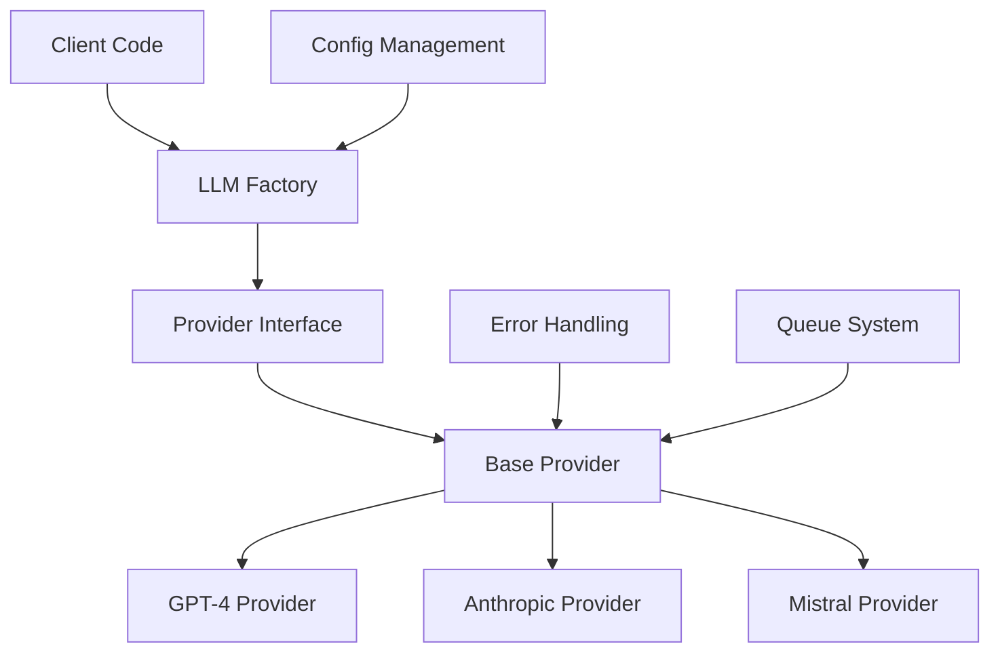

# LLM Integration System Documentation

## Table of Contents
1. [System Architecture](#system-architecture)
2. [Provider Implementation](#provider-implementation)
3. [API Reference](#api-reference)
4. [Error Handling](#error-handling)
5. [Performance Optimization](#performance-optimization)

## System Architecture

### Overview
The LLM (Large Language Model) integration system provides a flexible, extensible architecture for integrating multiple AI providers while maintaining consistent interfaces and error handling.



### Core Components

#### Provider Factory Pattern
The system uses a singleton factory pattern to manage provider instances:

```typescript
export class LLMProviderFactory {
  private static instance: LLMProviderFactory;
  private providers: Map<ProviderType, ILLMProvider>;

  public static getInstance(): LLMProviderFactory {
    if (!LLMProviderFactory.instance) {
      LLMProviderFactory.instance = new LLMProviderFactory();
    }
    return LLMProviderFactory.instance;
  }
}
```

#### Provider Interface
All LLM providers implement a common interface:

```typescript
export interface ILLMProvider {
  generateContent(prompt: string): Promise<string>;
  analyzeContent(content: string): Promise<AnalysisResult>;
  optimizeContent(content: string): Promise<string>;
}
```

#### Base Provider Implementation
Abstract base class implementing common functionality:

```typescript
export abstract class BaseLLMProvider implements ILLMProvider {
  protected config: LLMConfig;

  constructor(config: LLMConfig = {}) {
    this.config = {
      maxRetries: 3,
      timeout: 30000,
      temperature: 0.7,
      maxTokens: 2048,
      ...config,
    };
  }

  protected async retryOperation<T>(
    operation: () => Promise<T>, 
    retryCount = 0
  ): Promise<T>;
}
```

### Configuration Management

The system supports provider-specific and global configurations:

```typescript
export interface LLMConfig {
  maxRetries?: number;
  timeout?: number;
  temperature?: number;
  maxTokens?: number;
  apiKey?: string;
  [key: string]: unknown;
}
```

### Error Handling

Comprehensive error handling with custom error types:

```typescript
export class LLMError extends Error {
  constructor(
    message: string,
    public readonly provider: string,
    public readonly code?: string,
    public readonly details?: unknown
  ) {
    super(message);
    this.name = 'LLMError';
  }
}
```

### Queue Integration

The system integrates with BullMQ for task processing:

```typescript
interface QueueConfig {
  concurrency?: number;
  backoff?: {
    type: 'exponential' | 'fixed';
    delay: number;
  };
}
```

## Provider Implementation

### Adding a New Provider

1. Create provider class extending BaseLLMProvider
2. Implement required interface methods
3. Add provider type to factory

Example:

```typescript
export class CustomProvider extends BaseLLMProvider {
  async generateContent(prompt: string): Promise<string> {
    return this.retryOperation(async () => {
      // Provider-specific implementation
    });
  }

  async analyzeContent(content: string): Promise<AnalysisResult> {
    // Implementation
  }

  async optimizeContent(content: string): Promise<string> {
    // Implementation
  }
}
```

### Configuration Management

Provider-specific configuration:

```typescript
export interface CustomProviderConfig extends LLMConfig {
  modelVersion?: string;
  apiEndpoint?: string;
}
```

### Usage Example

```typescript
const provider = createLLMProvider({
  type: 'gpt4',
  config: {
    apiKey: process.env.GPT4_API_KEY,
    maxTokens: 1000,
    temperature: 0.7
  }
});

const response = await provider.generateContent('Hello, how are you?');
```

## API Reference

### Endpoints

#### Generate Content
- Method: POST
- Path: `/api/ai/generate`
- Authentication: Required
- Request Body:
```typescript
{
  prompt: string;
  provider?: ProviderType;
  config?: Partial<LLMConfig>;
}
```

#### Analyze Content
- Method: POST
- Path: `/api/ai/analyze`
- Authentication: Required
- Request Body:
```typescript
{
  content: string;
  provider?: ProviderType;
}
```

### Type Definitions

#### AnalysisResult
```typescript
interface AnalysisResult {
  sentiment: 'positive' | 'negative' | 'neutral';
  toxicity: number;
  keywords: string[];
  summary: string;
  language: string;
}
```

## Error Handling

### Error Types

1. Configuration Errors
2. API Errors
3. Rate Limit Errors
4. Timeout Errors

### Error Recovery

The system implements automatic retry with exponential backoff:

```typescript
protected async retryOperation<T>(
  operation: () => Promise<T>,
  retryCount = 0
): Promise<T> {
  try {
    return await Promise.race([
      operation(),
      new Promise((_, reject) =>
        setTimeout(
          () => reject(new Error('Operation timed out')),
          this.config.timeout
        )
      )
    ]);
  } catch (error) {
    if (retryCount < this.config.maxRetries) {
      const delay = Math.pow(2, retryCount) * 1000;
      await new Promise(resolve => setTimeout(resolve, delay));
      return this.retryOperation(operation, retryCount + 1);
    }
    throw error;
  }
}
```

## Performance Optimization

### Caching Strategy

- Response caching
- Token optimization
- Batch processing

### Rate Limiting

```typescript
interface RateLimitConfig {
  maxRequests: number;
  window: number;
  provider: ProviderType;
}
```

### Resource Management

- Connection pooling
- Request queuing
- Memory management

### Monitoring

Integration with monitoring system:

```typescript
interface LLMMetrics {
  requestCount: number;
  errorRate: number;
  averageLatency: number;
  tokenUsage: number;
}