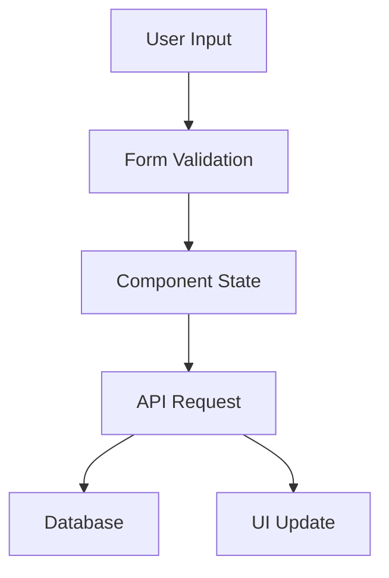

# Settings Implementation Documentation

## Overview
The settings interface provides a comprehensive system for managing user preferences, notifications, platform connections, and appearance settings. Built with Next.js, TypeScript, and React Hook Form, it offers a type-safe, accessible, and responsive user experience.

## Architecture

### Components

#### `SettingsLayout`
- Main container component that handles tab navigation
- Manages global settings state and save status
- Provides consistent layout and error handling

```tsx
<SettingsLayout initialData={userSettings} />
```

#### Section Components

1. **ProfileSection**
   - Handles user profile information
   - Fields: name, email, avatar, timezone, language
   - Validates email format and required fields

2. **NotificationSection**
   - Manages notification preferences
   - Settings: email, push, digest frequency
   - Configurable notification types

3. **PlatformSection**
   - Handles social media platform connections
   - Platform-specific posting preferences
   - Connection/disconnection workflow

4. **AppearanceSection**
   - Controls UI preferences
   - Theme selection (light/dark/system)
   - Layout density options

### Data Flow



## Type System

### Core Interfaces

```typescript
interface UserSettings {
    profile: {
        name: string;
        email: string;
        avatar?: string;
        timezone: string;
        language: string;
    };
    notifications: {
        email: boolean;
        push: boolean;
        digest: 'daily' | 'weekly' | 'none';
        types: {
            posts: boolean;
            mentions: boolean;
            analytics: boolean;
        };
    };
    platforms: {
        [key: string]: {
            connected: boolean;
            username?: string;
            lastSync?: Date;
            preferences: {
                autoPost: boolean;
                requireApproval: boolean;
            };
        };
    };
    appearance: {
        theme: 'light' | 'dark' | 'system';
        density: 'comfortable' | 'compact';
        timezone: string;
    };
}
```

## API Integration

### Endpoints

- `GET /api/settings`: Fetch user settings
- `PATCH /api/settings`: Update user settings

### Example Usage

```typescript
// Fetch settings
const settings = await fetchSettings();

// Update settings
await updateSettings({
    profile: {
        name: 'New Name',
        language: 'es',
    },
});
```

## Form Validation

Uses Zod schemas for type-safe validation:

```typescript
const profileSchema = z.object({
    name: z.string().min(1, 'Name is required'),
    email: z.string().email('Invalid email format'),
    // ...
});
```

## Testing

### Component Tests
- Unit tests for each section component
- Integration tests for form submission
- Accessibility testing
- Mock API responses

### API Tests
- Endpoint validation
- Authentication checks
- Error handling
- Data persistence

## Accessibility Features

- ARIA labels for form controls
- Keyboard navigation support
- Focus management
- Screen reader announcements
- High contrast support

## Error Handling

1. Form Validation
   - Field-level error messages
   - Form-level validation
   - Real-time feedback

2. API Errors
   - Network error handling
   - Validation error display
   - Retry mechanisms

## Performance Considerations

- Optimistic updates
- Debounced save operations
- Lazy-loaded sections
- Minimal re-renders

## Usage Examples

### Basic Implementation

```tsx
import { SettingsLayout } from '@/components/settings';

export default function SettingsPage() {
    return (
        <div className="container">
            <SettingsLayout initialData={settings} />
        </div>
    );
}
```

### Custom Section Integration

```tsx
import { ProfileSection } from '@/components/settings';

function CustomProfile() {
    return (
        <ProfileSection
            initialData={data}
            onUpdate={handleUpdate}
            section="profile"
        />
    );
}
```

## Best Practices

1. **State Management**
   - Use form state for input handling
   - Implement optimistic updates
   - Handle loading states

2. **Error Handling**
   - Provide clear error messages
   - Implement retry mechanisms
   - Handle edge cases

3. **Performance**
   - Implement debouncing for saves
   - Optimize re-renders
   - Use proper memoization

4. **Accessibility**
   - Follow ARIA best practices
   - Support keyboard navigation
   - Test with screen readers

## Maintenance

### Adding New Settings

1. Update the `UserSettings` interface
2. Create validation schema
3. Add UI components
4. Update API handlers
5. Add tests

### Modifying Existing Settings

1. Update type definitions
2. Modify validation rules
3. Update UI components
4. Update tests
5. Handle migration if needed

## Troubleshooting

Common issues and solutions:

1. **Form Validation Errors**
   - Check Zod schema definitions
   - Verify form field names
   - Check error message mapping

2. **API Integration Issues**
   - Verify endpoint URLs
   - Check authentication
   - Validate request/response formats

3. **State Management Problems**
   - Check form initialization
   - Verify update handlers
   - Debug state transitions

## Future Improvements

1. **Features**
   - Multi-factor authentication settings
   - Advanced platform integrations
   - Custom notification rules

2. **Technical**
   - Real-time updates
   - Offline support
   - Performance optimizations

3. **UX Enhancements**
   - Guided setup wizard
   - Better error recovery
   - Enhanced accessibility